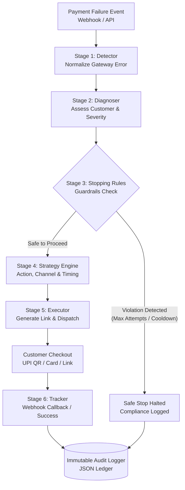

# Razorpay AI Revenue Recovery Agent

An autonomous, agentic payment recovery pipeline that dynamically diagnoses failed checkouts, orchestrates multi-channel dunning, enforces strict anti-spam stopping rules, and maximizes recovered merchant revenue with verifiable financial ROI.

---

## 📌 Problem Statement

In online commerce, **15% to 25% of checkout transactions fail**, costing merchants billions annually:
- **Root Cause Variety**: Payments fail for vastly different reasons—insufficient funds, temporary bank downtime, network timeouts, expired mandates, or incorrect CVV/OTP.
- **Dumb / Blind Retries**: Traditional payment systems either do nothing or trigger blind, fixed-interval retries that spam customers, damage merchant reputation, and incur card network penalties.
- **Customer Friction**: Customers are forced to abandon their purchase or manually re-enter payment details without helpful guidance on alternative payment rails (such as UPI when cards fail).
- **Compliance & Over-dunning Risks**: Uncontrolled retries trigger chargebacks, customer fatigue, and breach compliance policies.

---

## 💡 The Solution

The **Razorpay AI Revenue Recovery Agent** operates as an autonomous 6-stage lifecycle engine that intervenes at the moment of payment failure:
1. **Detects & Normalizes**: Automatically parses gateway webhooks and maps raw error codes into standardized failure categories.
2. **Diagnoses Context**: Evaluates customer history, prior attempts, payment rail reliability, and failure severity.
3. **Enforces Stopping Guardrails**: Halts outreach if retries exceed limits (max 3), respects cooldown windows (24 hours), and pauses upon customer "Promise to Pay".
4. **Engineers Optimal Strategy**: Selects the right channel (SMS, Email, Instant Auto-Retry), personalized messaging (English/Hindi), and strategic timing (e.g., waiting 72 hours for salary deposit on insufficient funds).
5. **Executes Multi-Channel Recovery**: Dispatches dynamic Razorpay payment links and recovery flows via official APIs or built-in test sandbox.
6. **Tracks & Verifies ROI**: Monitors recovery webhooks, logs immutable decision trails, and calculates net recovered revenue against outreach costs.

---

## ⚙️ System Architecture: 6-Stage Pipeline



---

## 🛠️ Tech Stack

| Layer | Technologies |
|---|---|
| **Backend Framework** | [FastAPI](https://fastapi.tiangolo.com/) (Python 3.10+), [Uvicorn](https://www.uvicorn.org/) ASGI |
| **Data & Storage** | SQLite (`recovery.db`), Python standard `sqlite3` |
| **Payment Gateway** | [Razorpay Python SDK](https://github.com/razorpay/razorpay-python), Razorpay Standard Checkout SDK (`checkout.js`) |
| **AI / Heuristic Engine** | Heuristic Decision Matrices + Optional [Google Gemini API](https://ai.google.dev/) / [OpenAI](https://openai.com/) |
| **Frontend Architecture** | Single-Page Application (SPA), Vanilla JavaScript (ES6+), HTML5 |
| **Styling & UI** | [Tailwind CSS](https://tailwindcss.com/) (CDN), [Lucide Icons](https://lucide.dev/) |
| **Data Visualization** | [Chart.js](https://www.chartjs.org/) (Stacked Bar, Donut, Cumulative Curves) |
| **Testing** | Python `unittest`, FastAPI `TestClient`, `httpx` |

---

## 🚀 Key Features

- 🛡️ **Autonomous 6-Stage Recovery Pipeline**: Full lifecycle tracking from gateway failure to verified payment settlement.
- 🎯 **Root-Cause Intelligent Dunning**: Custom recovery actions tailored to 8 distinct failure causes:
  - `card_declined` &rarr; Immediate UPI payment link recommendation.
  - `insufficient_funds` &rarr; Scheduled SMS retry (+72 hours for salary deposit).
  - `network_timeout` &rarr; Instant zero-friction auto-retry (+2 minutes).
  - `bank_server_down` &rarr; Bank downtime recovery link (+1 hour).
  - `otp_timeout` &rarr; Instant retry link (+5 minutes).
  - `invalid_cvv` / `user_input_error` &rarr; Frictionless re-entry checkout link.
  - `mandate_expired` &rarr; Subscription reauthorization flow.
- 🛑 **Strict Compliance Stopping Guardrails**:
  - Max **3 attempts** per transaction.
  - Mandatory **24-hour cooldown** window.
  - **Promise-to-Pay** safe pause.
  - Zero spam guarantee.
- 📈 **Financial ROI Multiplier**: Real-time calculation of Revenue at Risk, Recovered Revenue, Outreach Expenses, and Net Profit Multiplier.
- 🌐 **Interactive Recovery Checkout**: Self-hosted customer payment portal supporting:
  - Official Razorpay `checkout.js` popup modal.
  - In-page UPI QR code scan simulation.
  - Test Visa/Mastercard 3DS authorization modal.
  - NetBanking bank routing simulation.
- 📜 **Immutable JSON Audit Trails**: Complete chronological decision ledger with step-by-step reasoning and multi-language replay (English & Hindi).
- 🔒 **Zero Real Money Risk**: Sandboxed for Razorpay Test Mode (`rzp_test_...`) with full offline simulator fallback.

---

## 📁 Repository Structure

```text
Razorpay/
├── config.py                 # Configuration, env vars, stopping rules & strategy matrix
├── database.py               # SQLite schema, queries, metrics calculation & seeding
├── main.py                   # FastAPI application, REST endpoints, and webhook handlers
├── requirements.txt          # Python dependencies
├── render.yaml               # Cloud deployment configuration for Render
├── Procfile                  # Process file for Heroku / Render deployment
├── seed_demo.py              # Script to seed 75 realistic demo transactions
├── simulator.py              # Synthetic failure generator & probabilistic mock engine
├── test_api.py               # Automated unit & integration tests for API endpoints
├── test_pipeline.py          # Automated unit tests for the 6-stage recovery pipeline
├── .env.example              # Template for environment variables (copy to .env)
├── .gitignore                # Git ignore rules (protects credentials & local DB)
├── pipeline/                 # Core Autonomous Pipeline Modules
│   ├── __init__.py
│   ├── orchestrator.py       # Coordinates the 6-stage pipeline lifecycle
│   ├── detector.py           # Stage 1: Ingestion & error normalization
│   ├── diagnoser.py          # Stage 2: Contextual failure evaluation
│   ├── stopping_rules.py     # Stage 3: Anti-spam & compliance guardrails
│   ├── strategy_engine.py    # Stage 4: Optimal action, channel & timing selection
│   ├── executor.py           # Stage 5: Payment link generation & message dispatch
│   ├── tracker.py            # Stage 6: Payment outcome & webhook settlement tracking
│   └── audit_logger.py       # Immutable JSON decision logging
└── static/                   # Frontend Web Application
    ├── index.html            # Main Agent Dashboard (Command Center, Analytics, Audit)
    ├── checkout.html         # Interactive Customer Recovery Checkout Page
    └── app.js                # Frontend controller, Chart.js integrations & API calls
```

---

## 📋 Prerequisites

Before setting up the project, ensure you have:
- **Python 3.10** or higher installed ([Download Python](https://www.python.org/downloads/))
- **Git** installed ([Download Git](https://git-scm.com/))
- *(Optional)* A free [Razorpay Account](https://dashboard.razorpay.com/) in **Test Mode** to test real sandbox payments.

---

## ⚡ Quick Start / Setup Guide

### 1. Clone the Repository
```bash
git clone https://github.com/nandancs48/Razorpay_smart_payment_recovery_engine.git
cd Razorpay_smart_payment_recovery_engine
```

### 2. Create and Activate a Virtual Environment
- **On Windows (PowerShell / CMD)**:
  ```powershell
  python -m venv venv
  .\venv\Scripts\activate
  ```
- **On macOS / Linux**:
  ```bash
  python3 -m venv venv
  source venv/bin/activate
  ```

### 3. Install Dependencies
```bash
pip install -r requirements.txt
```

### 4. Configure Environment Variables
Copy the `.env.example` file to `.env`:
- **Windows (PowerShell)**:
  ```powershell
  Copy-Item .env.example .env
  ```
- **macOS / Linux**:
  ```bash
  cp .env.example .env
  ```

Open `.env` in any text editor:
```env
# Razorpay Test Mode Credentials (Optional)
# Leave blank to use built-in Mock Simulator mode
RAZORPAY_KEY_ID=rzp_test_your_key_id
RAZORPAY_KEY_SECRET=your_key_secret
RAZORPAY_WEBHOOK_SECRET=your_optional_webhook_secret

# Optional LLM Key for dynamic copy generation (Gemini or OpenAI)
GEMINI_API_KEY=
OPENAI_API_KEY=

# Server Config
PORT=8000
HOST=127.0.0.1
DEBUG=true
```
> [!NOTE]
> If you leave `RAZORPAY_KEY_ID` and `RAZORPAY_KEY_SECRET` empty, the application will automatically run in **Sandbox Simulator Mode**, allowing full demonstration without any external accounts.

### 5. Seed Demonstration Data
Initialize the SQLite database with 75 realistic payment failure scenarios:
```bash
python seed_demo.py
```
This seeds transactions across all failure categories (insufficient funds, bank downtime, network timeout, card declined, etc.) and runs them through the 6-stage recovery pipeline.

### 6. Run the Application
Start the Uvicorn development server:
```bash
python -m uvicorn main:app --host 127.0.0.1 --port 8000 --reload
```
or simply:
```bash
python main.py
```

### 7. Open the Web Application
Open your web browser and navigate to:
- **Agent Dashboard**: [http://127.0.0.1:8000](http://127.0.0.1:8000)
- **Interactive API Docs (Swagger UI)**: [http://127.0.0.1:8000/docs](http://127.0.0.1:8000/docs)
- **Alternative API Docs (ReDoc)**: [http://127.0.0.1:8000/redoc](http://127.0.0.1:8000/redoc)

---

## 🖥️ Application Features & Walkthrough

### 1. Command Center Dashboard
- **Live KPI Metrics**: Real-time counters for Total Revenue at Risk, Won Back Revenue, Recovery Rate %, Financial ROI Multiplier, and Safeguard Halts.
- **Search & Filter**: Search by Order ID, customer name, phone number, failure reason, or status (`recovered`, `retrying`, `stopped`).
- **Interactive Table**: View order details, payment rail, autonomous action taken, and click any row to inspect its decision trail or launch the recovery checkout.

### 2. Analytics & Conversion Science
- **Root Failure Cause Conversion**: Stacked bar chart showing won back vs. retrying vs. stopped by reason.
- **Cohort Distribution**: Donut chart displaying current status proportions across all transactions.
- **Cumulative Recovery Curve**: Real-time curve plotting cumulative revenue recovered against total revenue at risk.
- **Payment Method Efficiency**: Breakdown of conversion rates across UPI, Cards, and NetBanking.

### 3. Compliance & Exceptions Hub
- **Anti-Spam Verification**: Displays all transactions where outreach was stopped per compliance guardrails.
- **Stopping Reason Breakdown**: Visualizes limits reached (e.g. `max_attempts_reached`, `in_cooldown_window`).

### 4. Immutable JSON Audit Explorer
- View the complete timestamped ledger tracking raw payload, diagnosis, stopping rule evaluations, chosen action, execution parameters, and outcome verification.
- Export full JSON ledger via one-click download (`/api/export/audit-json`).

### 5. Simulating Failures & Batch Runs
- **Simulate Event**: Click **"Simulate Event"** in the top navigation bar to trigger a custom payment failure with customer name, amount, failure reason, and attempt count.
- **Run Batch**: Click **"Run 75-Payment Batch"** to simulate a fresh batch of transactions and observe pipeline metrics update in real time.
- **Export CSV**: Download transaction metrics directly to a CSV spreadsheet.

---

## 💳 Testing Razorpay Checkout

Every failed payment has a dedicated recovery checkout URL accessible at:
```text
http://127.0.0.1:8000/checkout/{order_id}
```
From this page, you can simulate recovery via:
1. **Official Razorpay Popup Modal**: Loads Razorpay's `checkout.js` standard modal (in Test Mode).
2. **Instant UPI & QR Code**: Click *"Simulate Scan & Pay"* to immediately mark the payment recovered.
3. **Card Payment with 3D Secure**: Click *"Pay with Card"*, enter the test OTP (`123456`), and confirm recovery.
4. **NetBanking**: Select HDFC or SBI and confirm payment.

Once paid, the order immediately transitions to **Recovered**, updating the financial ROI and dashboard metrics in real time.

---

## 🧪 Running Automated Tests

Run the full suite of automated unit and API integration tests:

```bash
# Test the 6-stage autonomous recovery pipeline & stopping rules
python -m unittest test_pipeline.py

# Test all FastAPI REST endpoints, webhooks, and audit trails
python -m unittest test_api.py
```

---

## 🌐 Cloud Deployment (Render / Heroku)

This repository includes deployment configurations for [Render](https://render.com) and Heroku-compatible platforms.

### Deploying on Render:
1. Fork or push this repository to GitHub.
2. Sign in to [Render](https://dashboard.render.com/) and click **New + &rarr; Blueprint**.
3. Connect your repository. Render will automatically detect [`render.yaml`](file:///d:/Razorpay/render.yaml).
4. *(Optional)* Add your `RAZORPAY_KEY_ID` and `RAZORPAY_KEY_SECRET` in the Render environment settings.
5. Click **Apply**. Your agent will be live with an HTTPS URL.

---

## 🔒 Security & Privacy

- **Never Commit Real API Keys**: The `.gitignore` explicitly ignores `.env` and SQLite database files.
- **Zero Real Money Charge Guarantee**: Only keys starting with `rzp_test_` are accepted by the system. Real production keys (`rzp_live_`) are intentionally blocked to guarantee zero accidental financial charges.
- **Offline Mock Fallback**: The platform functions seamlessly offline without any external API keys or cloud credentials.

---

## 📄 License

This project is licensed under the [MIT License](LICENSE).
